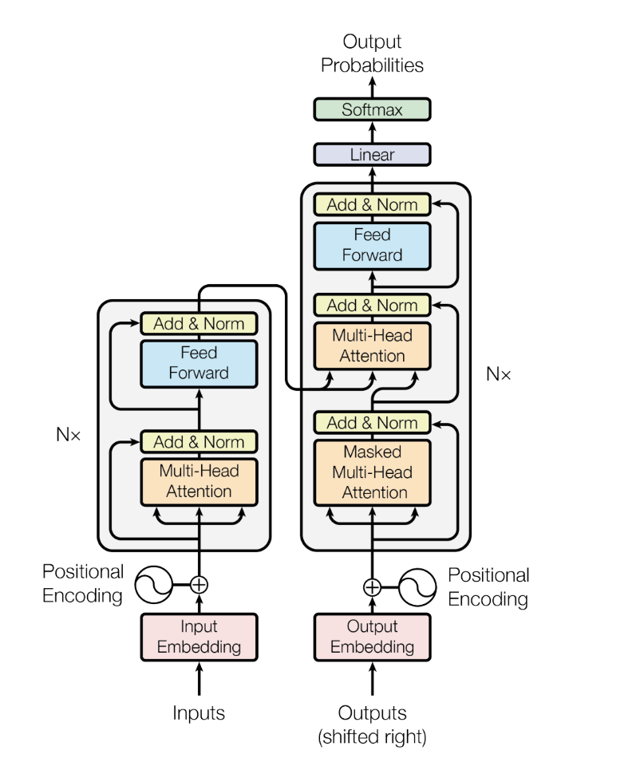
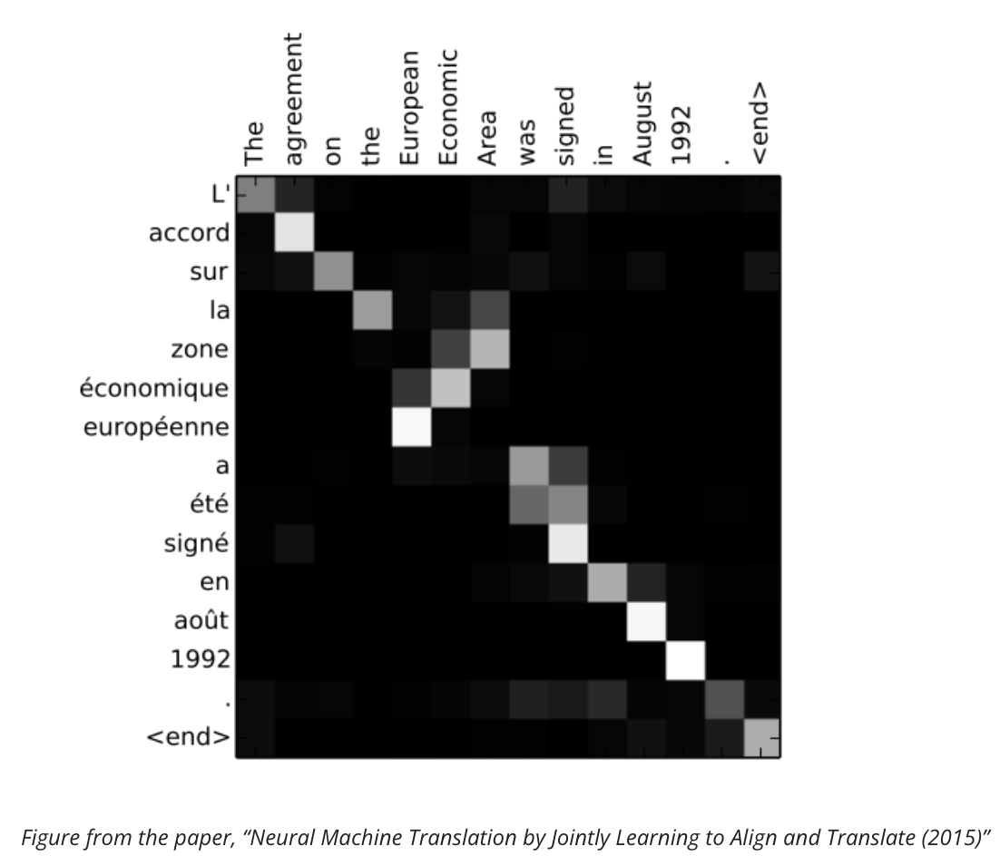

# Transformers


from Daleonai.com


1. Positional Encodings
   1. \[("The", 1), ("aliens", 2), ("say", 3), ("hello", 4)]
   2. Put structure into the data
2. Attention
   1. _The agreement on the European Economic Area was signed in August 1992._
   2.  _L’accord sur la zone économique européenne a été signé en août 1992._

1. Self-Attention

* “Server, can I have the check?”
* “Looks like I just crashed the server.”

### A Hammer for all nails

